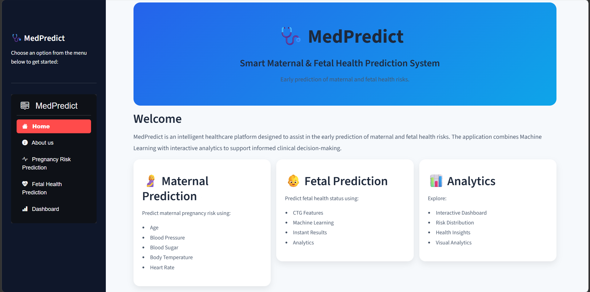
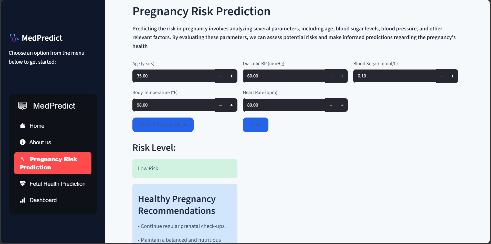
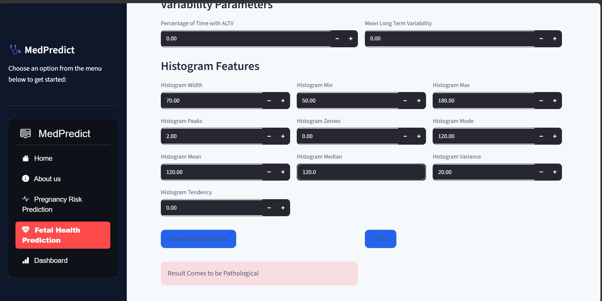
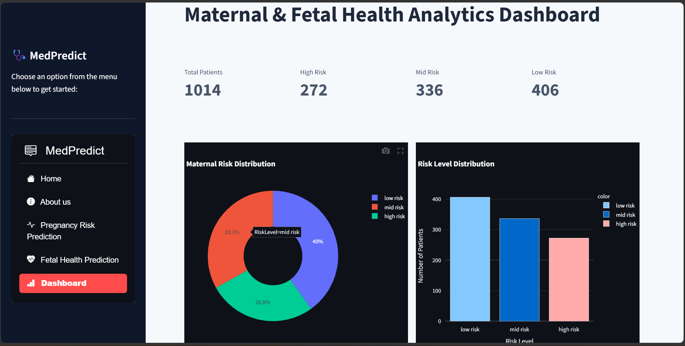
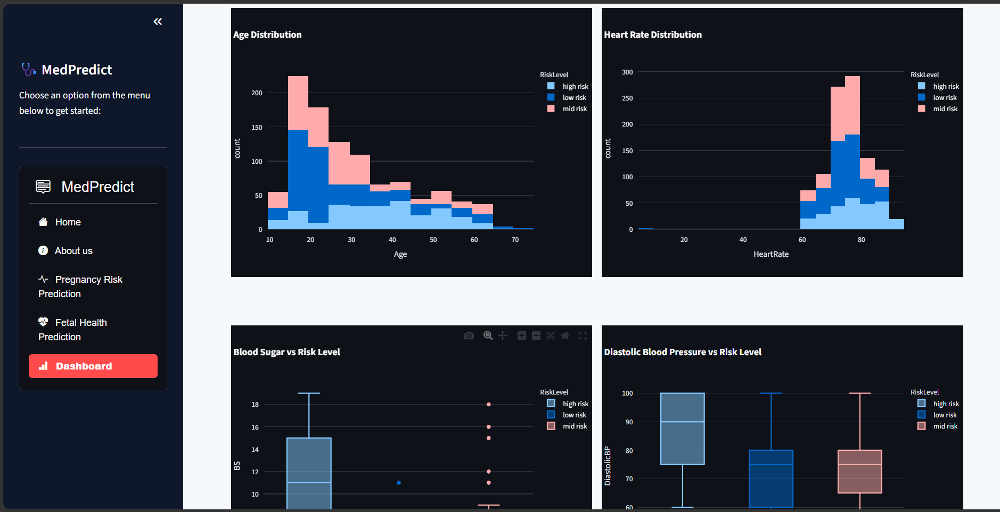

# 🩺MedPredict

## Maternal & Fetal Health Prediction System

MedPredict is a Machine Learning-powered healthcare application that predicts **maternal pregnancy risk** and **fetal health status** using clinical parameters. The system also includes an interactive analytics dashboard for visualizing healthcare insights and dataset trends.

---

# Features

- 🤰 Maternal Pregnancy Risk Prediction
- 👶 Fetal Health Prediction
- 📊 Interactive Analytics Dashboard
- 💡 Personalized Health Recommendations
- 📈 Data Visualization using Plotly
- ⚡ Instant Predictions
- 🎨 Modern Streamlit Interface

---

# Live Demo

https://medpredict-rv6vungo5ceftgblgbbk3m.streamlit.app/

# Application Preview

## Home




## Maternal Risk Prediction




## Fetal Health Prediction




## Analytics Dashboard






#  Machine Learning Models

## Maternal Health Prediction

Input Features

- Age
- Diastolic Blood Pressure
- Blood Sugar
- Body Temperature
- Heart Rate

Output Classes

- Low Risk
- Medium Risk
- High Risk


## Fetal Health Prediction

Input

- 21 Cardiotocography (CTG) Features

Output Classes

- Normal
- Suspect
- Pathological


# Dashboard

The dashboard provides interactive healthcare analytics including

- Risk Distribution
- Risk Level Comparison
- Age Distribution
- Blood Sugar Analysis
- Blood Pressure Analysis
- Heart Rate Analysis
- Correlation Heatmap
- Dataset Preview
- Key Insights


# Tech Stack

| Category | Technologies |
|-----------|--------------|
| Language | Python |
| Framework | Streamlit |
| ML | Scikit-Learn |
| Visualization | Plotly |
| Data Processing | Pandas, NumPy |
| Model Storage | Pickle |


# Run the application

```bash
py -m streamlit run app.py
 ```


# Author
**Cherry Todi**
